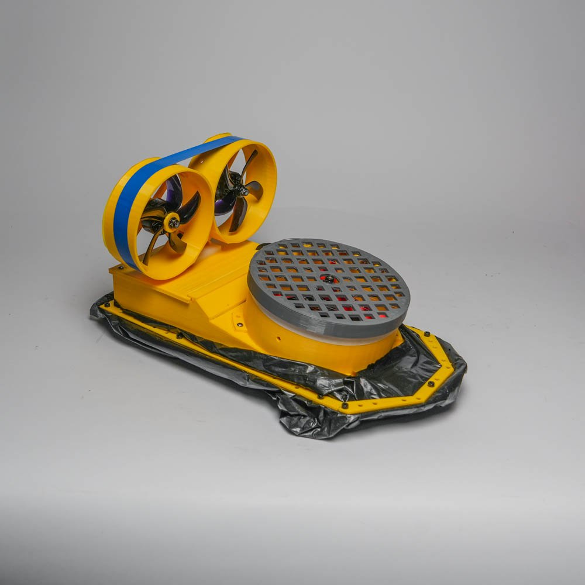

# Воздушная подушка 🚤

**Технологический стек проекта:**

**⏱️ Время разработки:** 3 месяца
**💰 Стоимость комплектующих:** ≈ 15 561 ₽

---

**Мы будем благодарны за вашу подписку на наш [telegram канал](https://t.me/pcp_podushka) 📢**. Здесь же можете задать все интересующие вас вопросы.

Здесь выложены все исходники проекта `воздушной подушки`, которую мы ласково прозвали `"Чебурашка"` 🧸.

## Компоненты 🔧

Для сборки проекта потребуются следующие компоненты:

### Электроника ⚡

| Компонент | Количество | Примерная цена | Назначение |
|-----------|------------|----------------|------------|
| **ESP32-WROOM-32** (CH340C) | 1 шт | 516 ₽ | Основной контроллер управления 🎛️ |
| **FRSKY R9mini-OTA** приемник | 1 шт | 1 968 ₽ | Приемник радиоуправления (900 МГц) 📡 |
| **ESC 50A BLHeli** однонаправленный | 2 шт | 2 768 ₽ | Контроллеры двигателей поворота 🔄 |
| **ESC 80A BLHeli** двунаправленный | 1 шт | 2 161 ₽ | Контроллер двигателя нагнетателя 💨 |
| **Двигатель 3115 900kv Spinner Production** | 1 шт | 1 617 ₽ | Нагнетательный двигатель 🌀 |
| **Двигатель BAT-Surpass B2808 1500KV** | 2 шт | 2 946 ₽ | Двигатели поворота ⚙️ |
| **Аккумулятор Tattu R-Line V3 1300mAh 6S** | 1 шт | 3 585 ₽ | Питание системы 🔋 |

**Итого:** ≈ 15 561 ₽ (в цену не включен аппаратура `Radiomaster TX16S`, так у нас он уже был)

## 3D Модели 🖨️

Все необходимые 3D модели были разработаны нами в таких CAD системах как Blender, 3D Max и Solid Works (последнюю программу крайне не рекомендуем ❌).

Детали можно найти в папке [stl/](stl/)

## Схема подключения 🔌

Вся схема показана [тут](scheme/scheme.png)

## Прошивка 💾

Работаем мы с серией недорогих микропроцессоров с малым энергопотреблением китайской компании Espressif Systems, а именно c esp32 архитектур RISC-V.

Прошивку с нашими PPM (Pulse Position Modulation, Импульсно-позиционная модуляция) для esp32 можно найти [тут](airbag.ino). Опять же не обязательно брать наши компоненты. Вы можете взять другие моторы, контроллеры оборотов, другой передатчик, вообщем все, что угодно, **НО не забудьте поменять скрипт airbag.ino** ⚠️.

## Небольшое руководство 📝

### 🛡️ Безопасность
Для безопасной работы, после пайки рекомендуем все оголенные участки проводов зажать в термоусадку.

### 📡 Настройка приемника
Приемник используется от компании FrSky, называется `FRSKY R9mini-OTA`. Сразу после получения рекомендуем обновить его прошивку до последней версии, есть огромное количество видео как это сделать. Все прошивки данной компании [тут](https://www.frsky-rc.com/download/). Версия нашей прошивки можно [скачать из нашего репозитория](FW-R9MINI-R9MM-OTA_v1.3.1).

### 🔋 Работа с аккумулятором
Аккумулятор 6S LiPo требует осторожного обращения:
- ⛔ Никогда не оставляйте заряженный аккумулятор без присмотра
- 🎒 Храните в специальном огнестойком мешке
- ⚖️ Используйте балансирную зарядку
- 📉 Не разряжайте ниже 3.2В на элемент

---

## ⚠️ WARNING / ВАЖНО!

> **ВНИМАНИЕ:** Все компоненты подобраны для работы в единой системе. Замена компонентов может потребовать изменения прошивки и механических доработок. При работе с LiPo аккумуляторами соблюдайте все меры пожарной безопасности! Перед первым запуском тщательно проверьте все соединения и калибровку ESC.

